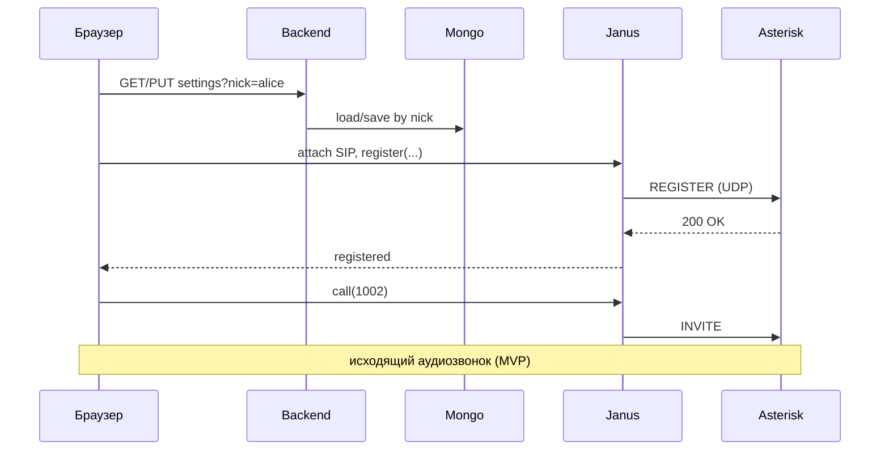

# План: браузерный SIP softphone на Janus

Документ описывает реализацию веб-клиента, который **регистрируется на PBX как внутренний номер** (SIP REGISTER) и позволяет звонить из браузера «как с трубки».

Выбранный стек (по [`ANALYSIS-sip-register-options.md`](./ANALYSIS-sip-register-options.md)): **вариант A — Janus SIP plugin**.

Репозиторий greenfield — план под простую локальную MVP.

---

## 1. Цель и критерий готовности MVP

Очень простой softphone: пользователь = **ник** в форме входа; SIP-настройки хранятся на backend по нику.

| Возможность | В MVP? |
|-------------|--------|
| «Вход» по нику (без пароля приложения) | Да |
| Один раз сохранить SIP-настройки (server, login, password) в Mongo по нику | Да |
| REGISTER на тестовый Asterisk + **исходящий** аудиозвонок | Да |
| Входящие (accept / reject) | **После MVP** (отдельный этап) |
| Hold / перевод / DTMF / видео / история / второй язык | Нет |
| TLS / SRTP / TURN в compose | Нет |

**Критерий готовности MVP:** ввёл ник → (при необходимости) сохранил SIP-данные → Registered на Asterisk → исходящий звонок на тестовый номер → двусторонний звук.

Входящие сознательно отложены: сначала стабилизируем исходящие.

---

## 2. Зафиксированные решения

| # | Тема | Решение |
|---|------|---------|
| 1 | Объём MVP | Softphone: **только исходящие** аудио. Входящие — следующим этапом. |
| 2 | Продукт | Чистый softphone, не коллектив/LiveKit. |
| 3 | Регистрация | **Режим softphone (A)** — см. §3. |
| 4 | Тестовая PBX | **Asterisk в docker-compose**, простая конфига, 2+ extension. Транспорт: **UDP**, plain SIP + RTP. |
| 5 | Где крутится стек | Только **localhost + Docker**. |
| 6 | Идентификация | **Нет auth как такового:** форма «ник» = пользователь. Другой ник → другой пользователь (другой документ в Mongo). |
| 7 | Credentials | **Backend + MongoDB `mongo:5.0.8`**: SIP server/login/password по `nick`. Ввёл SIP один раз → дальше только ник и звонки. |
| 8 | Медиа | Только аудио. |
| 9 | UI | Русский. Без истории. Максимально простой. |
| 10 | TURN / HTTPS | Без TURN; всё на **localhost**. |

---

## 3. Регистрация (режим softphone)

```
A. Softphone (вкладка = трубка)     ← MVP
─────────────────────────────────
Браузер онлайн  → Janus REGISTER → Asterisk: extension online
Браузер закрыт  → сессия умерла  → Asterisk: extension offline
```

Janus сам «вечную трубку» не держит — только пока жива session/handle. Режим B (always-on + auto-busy) — вне скоупа.

---

## 4. Архитектура MVP

```
Браузер (Call UI, localhost:3100)
   │  ник (без пароля приложения)
   │  WebSocket → Janus + WebRTC (аудио)
   ▼
Backend API (localhost:3101)
   │  SIP-настройки по nick
   ▼
MongoDB (mongo:5.0.8)

Браузер ── Janus API ──▶ Janus (SIP plugin)
                            │
                            └── SIP REGISTER/INVITE (UDP) ──▶ Asterisk (Docker)
```

**Принцип:** браузер с Asterisk по SIP не говорит. SIP делает Janus.  
После выбора ника backend отдаёт сохранённые SIP-credentials UI → `register` в Janus (для localhost ок).



### Компоненты

| Компонент | Назначение | Локально |
|-----------|------------|----------|
| **Asterisk** | Тестовый registrar + dialplan | SIP UDP `5060` (в Docker-сети / published) |
| **Janus** | SIP plugin, WebRTC | `ws://localhost:8188` |
| **Backend** | CRUD SIP-настроек по `nick` | `http://localhost:3101` |
| **MongoDB** | `mongo:5.0.8` | только внутри Docker-сети |
| **Call UI** | Ник, SIP-форма, dial, call | `http://localhost:3100` |

### Тестовый Asterisk (черновик)

Минимальная PJSIP (или chan_sip) конфигурация в `asterisk/`:

| Extension | Secret (пример) | Назначение |
|-----------|-----------------|------------|
| `1001` | `pass1001` | Браузерный softphone (основной) |
| `1002` | `pass1002` | Второй абонент: softphone / Zoiper / второй браузер позже |

Dialplan: `1001` ↔ `1002` звонят друг другу.  
Для первого исходящего без второго человека можно добавить `1000` → `Playback(demo-congrats)` / Echo — удобный smoke-test «набрал и услышал».

SIP-сервер в настройках UI для Janus: hostname сервиса compose, например `asterisk` (из контейнера Janus) или `host.docker.internal` / IP — зафиксируем в README при подъёме.

---

## 5. Потоки

### 5.1. «Вход» по нику

1. Пользователь вводит **ник** (например `alice`) → «Войти».
2. Пароля приложения нет. Ник уходит в API как ключ пользователя (`nick`).
3. Если для ника уже есть SIP-настройки — подтягиваем; иначе показываем форму SIP.

Смена ника = другой пользователь (другие SIP-данные). Сессию приложения можно держать в `sessionStorage` (ник).

### 5.2. Первичная настройка SIP (один раз на ник)

1. Поля: SIP-сервер, логин (extension), пароль.
2. `PUT` в backend → Mongo `{ nick, server, username, password }`.
3. Сразу `register` через Janus; статус Registered / ошибка.

Для стенда по умолчанию подсказать: server = адрес Asterisk, `1001` / `pass1001`.

### 5.3. Исходящий (MVP)

1. Номер (`1002` или `1000` echo) → Позвонить.
2. dialing → ringing → in-call → ended.
3. Аудио: mic + remote `<audio>`; mute + hangup.

### 5.4. Выход / закрытие

- Hangup.
- Unregister + destroy Janus session (best-effort).
- Смена ника / «Выйти» сбрасывает текущую Janus-сессию.

### 5.5. Входящие — после MVP

Отдельный этап: incoming event → принять / отклонить.  
Пока вкладка закрыта — на Asterisk offline (режим A).

---

## 6. UI (минимум)

1. Экран: поле **ник** + «Войти» (без пароля).
2. SIP-настройки (первый раз или «Изменить»).
3. Статус линии: offline / registered / error.
4. Поле номера + «Позвонить».
5. Панель звонка: mute, hangup (**без** UI входящего в MVP).
6. Короткий лог событий (для отладки).

---

## 7. Этапы реализации

### Этап 0 — Инфра

- [x] `docker-compose`: **Asterisk**, Janus (SIP + WS), Mongo `5.0.8`, backend; web — Vite на хосте.
- [x] Простые конфиги Asterisk: extensions `1001`/`1002` (+ echo `1000`).
- [x] Janus: SIP plugin, CORS под `localhost:3100`.
- [x] Без coturn / без TLS.

**Exit:** Asterisk слушает SIP; Janus info + SIP plugin; Mongo доступна; из сети compose Janus резолвит `asterisk`.

### Этап 1 — Backend по нику

- [x] Модель: `{ nick, sip: { server, username, password } }`.
- [x] API: `GET/PUT /api/users/:nick/sip`. Без password-login.
- [x] Ник нормализовать (trim, lower-case).

**Exit:** curl сохраняет/читает SIP по нику.

### Этап 2 — UI + REGISTER

- [x] React + Vite: ник → настройки SIP → Janus register.
- [x] Статус Registered на Asterisk (`pjsip show contacts`).

**Exit:** `1001` виден как registered с Contact на Janus.

### Этап 3 — Исходящий (конец MVP)

- [x] Dial / hangup / mute, двусторонний звук.
- [x] Smoke: звонок на `1000` (Playback) и/или `1004` (Echo).
- [x] README: compose up, ники, тестовые extensions.

**Exit MVP:** исходящий с браузера через Janus на Asterisk работает.

### Этап 4 — Входящие

- [x] Incoming UI: принять / отклонить.
- [x] Проверка: второй endpoint / второй браузер звонит на `1001`.

### Этап 5 — Monitor (Janus)

- [x] Отдельный сервис `monitor` в compose (порт 3110).
- [x] Только Janus Admin API: REGISTER + `display_name` + активные разговоры (`call_status` / `callee`).
- [x] Без Mongo и без Asterisk в мониторе.

---

## 8. Готовность к реализации

**Открытых блокирующих вопросов нет.** Можно начинать Этап 0.

| Тема | Default |
|------|---------|
| UI | React + Vite |
| Backend | Node.js (Express или Fastify) |
| Клиент Janus | `janus.js` + WebSocket |
| Asterisk | PJSIP, UDP `5060`, demo extensions выше |
| Идентификация | Только `nick`, без пароля приложения |
| SIP password → браузер после выбора ника | Да (localhost MVP) |

---

## 9. Риски

1. Сеть Docker: Janus должен звонить на hostname `asterisk`, а в форме UI — тот адрес, который **достижим из контейнера Janus** (не `localhost` с точки зрения Janus, если Asterisk в другом контейнере).
2. Кодеки (PCMU/PCMA/Opus) — возможен one-way audio.
3. Несколько вкладок на один extension — конфликт Contact; одна вкладка на ник/extension.
4. SIP-пароль в памяти браузера на время сессии — осознанно для localhost.

---

## 10. Структура репозитория (черновик)

```
janus-sample/
  ANALYSIS-sip-register-options.md
  PLAN-janus-sip-softphone.md
  docker-compose.yml
  asterisk/        # pjsip.conf, extensions.conf, …
  janus/           # конфиги Janus
  api/             # backend
  web/             # Call UI
  README.md
```

---

## 11. Вне скоупа MVP

- Входящие (Этап 4).
- Режим B (always-on register).
- Пароль/сессии приложения, OAuth и т.п.
- LiveKit / коллектив / видео / история / DTMF / hold / transfer.
- TURN в compose, TLS/SRTP, прод-харднинг.

---

## 12. Следующий шаг

Начинать **Этап 0**: `docker-compose` с Asterisk (простые `1000`/`1001`/`1002`) + Janus + Mongo + каркас API.
`)