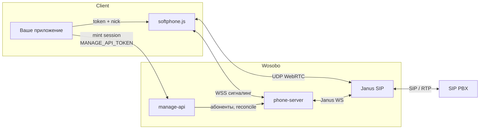
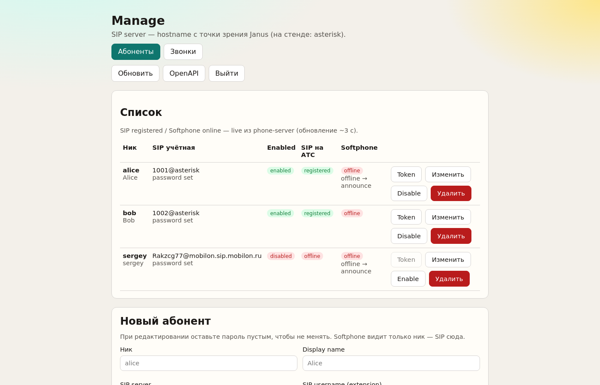
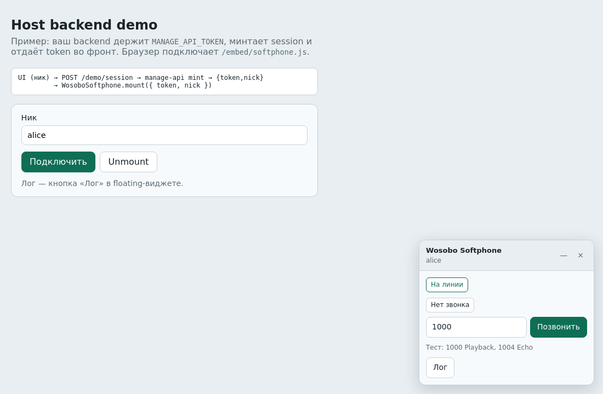
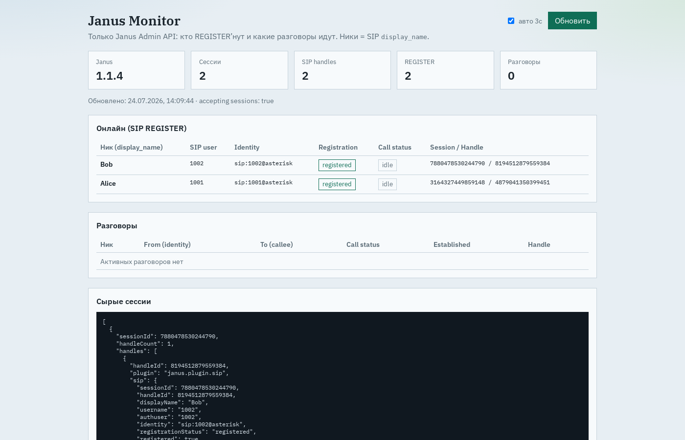

# Wosobo — WebRTC softphone к SIP PBX

Серверный softphone-шлюз: браузер звонит через WebRTC, SIP-секреты и REGISTER остаются на сервере. Виджет встраивается в любое HTTPS-приложение; учёт абонентов и сессии — через Manage API.

Подробная интеграция для внешней системы: [`docs/INTEGRATION.md`](./docs/INTEGRATION.md).

## Как это работает



1. В Manage задаёте **ник ↔ SIP** на вашей АТС (пароль только на сервере).
2. Ваш backend минтает короткоживущий **session token**.
3. Страница грузит `/embed/softphone.js` и вызывает `WosoboSoftphone.mount({ token, nick })`.
4. Сигналинг — WSS к phone-server; медиа — WebRTC ↔ Janus ↔ SIP/RTP на PBX.
5. Закрытие вкладки **не** снимает SIP REGISTER (always-on линия).

## Ключевые возможности

- **SIP-секреты не в браузере** — только ник и session token
- **Встраиваемый виджет** — IIFE `WosoboSoftphone` для любой host-страницы
- **Manage API + UI** — CRUD абонентов, mint session, журнал звонков (CDR), OpenAPI
- **Always-on REGISTER** — линия на АТС живёт без открытого softphone
- **Absent announce** — офлайн softphone может ответить фразой вместо 486
- **Janus Monitor** — кто REGISTER’нут и какие разговоры идут
- **Prod-пакет** — образ `wosobo` + `prod_deploy/` (Caddy, Janus, compose)

## Скриншоты

### Manage (админка абонентов)



### Softphone (embed-виджет)



### Janus Monitor



## Быстрый старт (локально)

```bash
echo '127.0.0.1 service' | sudo tee -a /etc/hosts
docker compose -f dev_local/docker-compose.yml up -d --build
```

| URL | Что |
|-----|-----|
| https://service/manage/ | Manage UI — token `dev-manage-token` |
| https://service/demo/ | Demo: ник → mint → виджет |
| https://service/monitor/ | Janus Monitor |
| https://service/embed/softphone.js | Скрипт встройки |
| https://service/manage-api/api/manage/docs | OpenAPI |

TLS: внутренний сертификат Caddy — один раз принять предупреждение в браузере. Softphone нужен **HTTPS** (или localhost) для микрофона.

Тестовые extensions Asterisk: `1001` alice, `1002` bob, `1000` Playback, `1004` Echo.

### Mint и embed (кратко)

```bash
# host backend (пример)
curl -sk -X POST -H "Content-Type: application/json" \
  https://service/demo/session -d '{"nick":"alice"}'
```

```html
<script src="https://service/embed/softphone.js"></script>
<script>
  WosoboSoftphone.mount({ token: "...", nick: "alice" });
</script>
```

## Каталоги

| Путь | Назначение |
|------|------------|
| [`docs/INTEGRATION.md`](./docs/INTEGRATION.md) | Контракты API, auth, встройка для интеграторов |
| [`dev_local/`](./dev_local/) | Локальный стенд (Asterisk + Janus + Caddy) |
| [`build/`](./build/) | Сборка образа `wosobo` |
| [`prod_deploy/`](./prod_deploy/) | Prod: `install.env` → `configure.sh` → `result/` |
| [`packages/`](./packages/) | manage-api, phone-server, softphone-embed, … |
