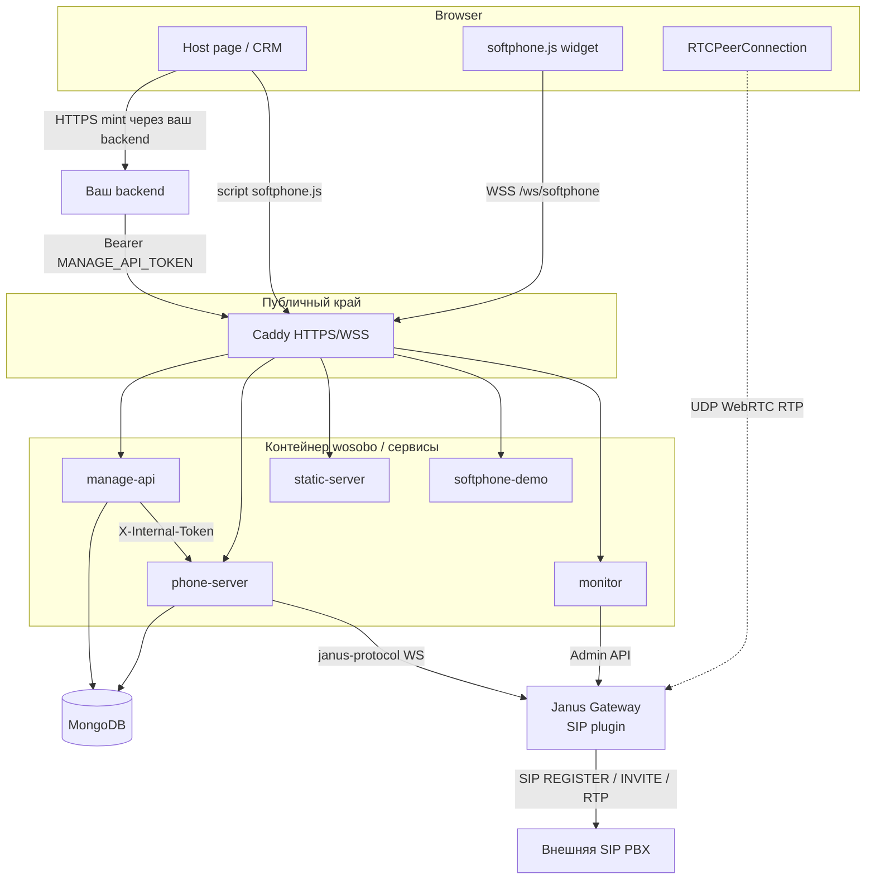
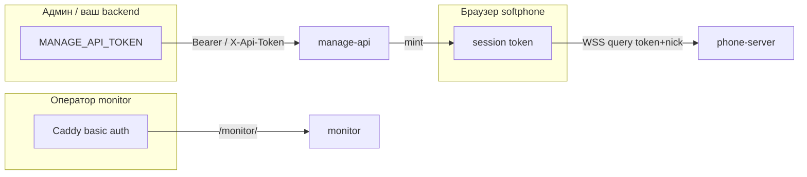
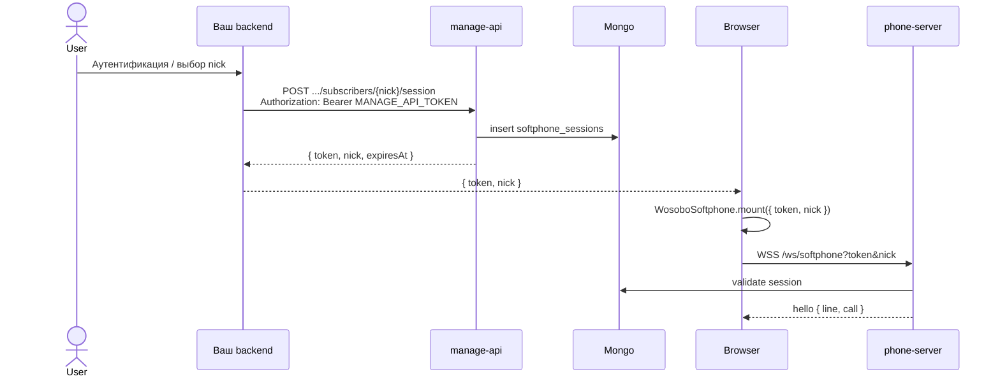
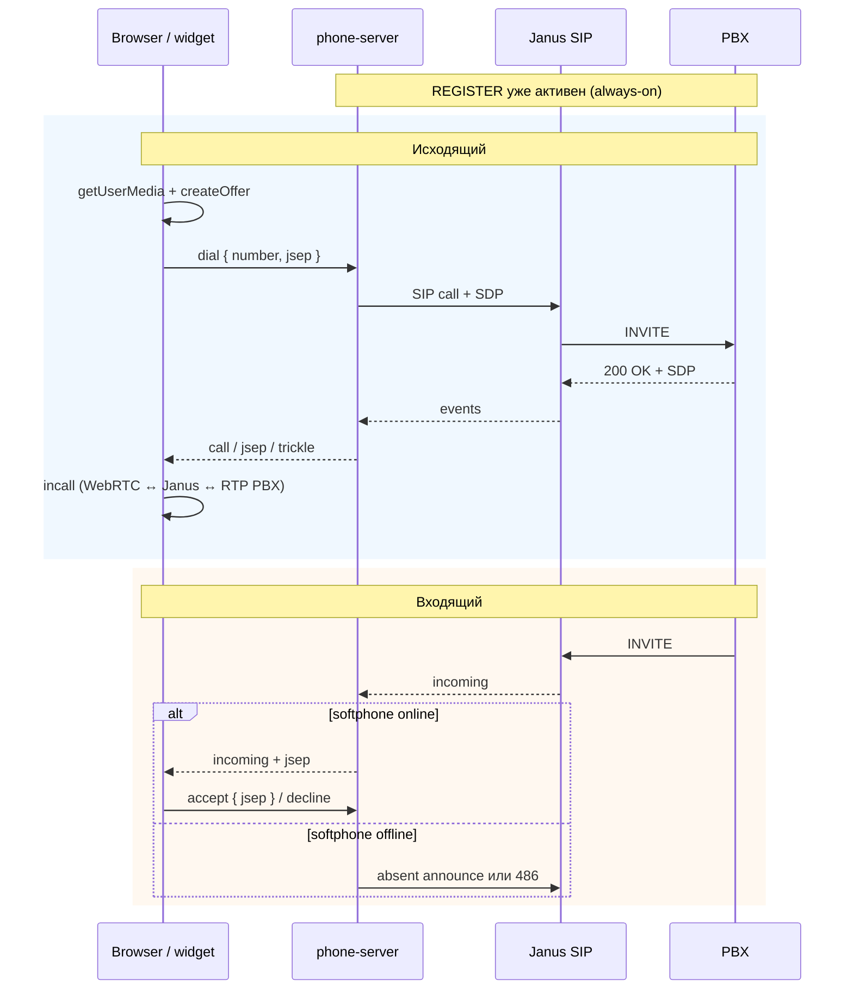
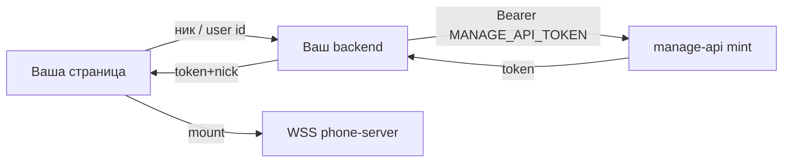
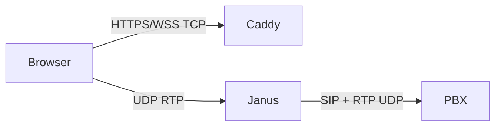

# Wosobo — описание для внешней интеграции

Документ описывает концепцию стенда softphone (Wosobo), публичные интерфейсы, авторизацию, встройку виджета и сетевые условия. Цель — дать достаточно деталей, чтобы внешняя система могла спроектировать и реализовать интеграцию без чтения исходников.

Живой контракт Manage API: `GET https://<DOMAIN>/manage-api/api/manage/docs` (OpenAPI: `/manage-api/api/manage/openapi.json`). Исходник схемы: `packages/manage-api/openapi/openapi.yaml`.

---

## 1. Концепция

Wosobo — серверный softphone-шлюз между **браузером (WebRTC)** и **SIP PBX**.

| Принцип | Следствие |
|---------|-----------|
| SIP-секреты только на сервере | Браузер никогда не получает `sip.password`, не ходит в Janus и не шлёт SIP |
| Абонент = **ник** | Внешняя система оперирует коротким `nick`, а не SIP URI |
| Always-on REGISTER | Линия на PBX живёт, пока абонент `enabled` и phone-server работает — закрытие вкладки **не** снимает REGISTER |
| Короткоживущая session | Браузер получает opaque token (не JWT) и открывает WSS к phone-server |
| Медиа мимо HTTP | WebRTC UDP идёт на Janus (`PUBLIC_IP` + диапазон RTP), не через Caddy |

Типовой сценарий внешней системы:

1. Создать/обновить абонента в Manage API (ник ↔ SIP на вашей АТС).
2. Когда пользователь готов звонить — **на своём backend** сминтить session token.
3. На странице загрузить `/embed/softphone.js` и вызвать `WosoboSoftphone.mount({ token, nick })`.
4. Сигналинг — WSS; медиа — WebRTC ↔ Janus ↔ SIP/RTP на PBX.

---

## 2. Архитектура

### 2.1. Компоненты



| Сервис | Роль | Порт внутри сети |
|--------|------|------------------|
| **manage-api** | CRUD абонентов, mint session, CDR | `3121` |
| **phone-server** | Janus SIP линии, WSS softphone, CDR write | HTTP `3101`, WS `3102` |
| **static-server** | `/embed/softphone.js`, Manage UI | `3140` |
| **softphone-demo** | Пример host-backend (mint) + demo UI | `3130` |
| **monitor** | UI/прокси Janus Admin | `3110` |
| **mongo** | `subscribers`, `softphone_sessions`, `call_records` | `27017` |
| **janus** | WebRTC ↔ SIP | WS `8188`, Admin `7088`, RTP UDP |
| **caddy** | Единый HTTPS front | `80` / `443` |

В production все app-процессы обычно в одном образе `wosobo` (supervisord); снаружи публикуются Caddy + UDP RTP Janus. Asterisk есть только в `dev_local/` — в prod PBX внешняя.

### 2.2. Что видит браузер, а что нет

| Канал | Браузер |
|-------|---------|
| Manage API | Только через **ваш** backend (с `MANAGE_API_TOKEN`) или Manage UI оператора |
| Softphone session token | Да — после mint |
| WSS `/ws/softphone` | Да |
| SIP password / Janus WS / Admin | **Нет** |
| WebRTC media UDP | Да, напрямую к Janus |

---

## 3. Публичная поверхность (Caddy)

База: `https://<DOMAIN>` (или HTTP при `TLS_MODE=off` — для softphone обычно непригодно).

Caddy снимает префикс у части путей (`handle_path`):

| Публичный URL | Backend path | Backend |
|---------------|--------------|---------|
| `/manage-api/api/...` | `/api/...` | manage-api |
| `/demo/session` | `/session` | softphone-demo |
| `/monitor/...` | `/...` | monitor |

| Путь | Назначение |
|------|------------|
| `/manage-api/*` | Manage API |
| `/api/manage*` | 308 → `/manage-api{uri}` (совместимость) |
| `/api/*` | phone-server HTTP (`/api/health`, `DELETE /api/session`) |
| `/ws/*` | phone-server WebSocket |
| `/demo/*` | demo UI + `POST /demo/session` |
| `/embed/softphone.js` (+ `.map`) | IIFE-виджет |
| `/embed/softphone-headless.js` (+ `.map`) | IIFE headless API |
| `/manage/*` | Manage SPA |
| `/monitor/*` | Monitor (**basic auth** в prod) |
| `/embed`, `/softphone*` | редирект на `/demo/` |

**Не публикуется наружу:** `phone-server` `/internal/*` (только Docker-сеть, `X-Internal-Token`).

**Вне Caddy (firewall):** TCP `80`/`443`; UDP `JANUS_RTP_START`–`JANUS_RTP_END` на `PUBLIC_IP` (по умолчанию 20000–20100).

---

## 4. Модель данных абонента

**Nick** (идентификатор во внешней системе и в API):

```text
^[a-z0-9][a-z0-9._-]{0,31}$
```

Нормализация: trim + lowercase.

**Поля (запись):**

| Поле | Описание |
|------|----------|
| `displayName` | Отображаемое имя |
| `enabled` | `false` → нет mint, линия снимается |
| `absentAnnounce` | Если softphone offline при входящем — проиграть announce и повесить трубку (иначе SIP 486) |
| `sip.server` | Хост/IP PBX **как виден из Janus** (в dev часто `asterisk`) |
| `sip.username` | SIP user / extension |
| `sip.password` | Секрет (только write; в ответах — `passwordSet: boolean`) |
| `sip.authuser` | Опционально, если auth user ≠ username |
| `sip.transport` | По умолчанию `udp` |

**Runtime** (подмешивается из phone-server): `sipRegistered`, `lineStatus`, `lineDetail`, `softphoneOnline`, `callPhase`.

На пустой Mongo manage-api может засеять `alice`/`bob` с `sip.server: "asterisk"` — для prod с внешней АТС замените или удалите.

---

## 5. Авторизация

Три независимых контура:



### 5.1. `MANAGE_API_TOKEN` — Manage API

- Заголовок: `Authorization: Bearer <token>` **или** `X-Api-Token: <token>`.
- Защищает все `/api/manage/*` (кроме публичного health/docs UI; сами операции API требуют token).
- **Только server-side.** Браузер / embed token не должны его знать.
- Значение задаётся в `install.env` / `.env` (пустое → генерирует `configure.sh`).

### 5.2. Softphone session token — не JWT

- Выдача: `POST /manage-api/api/manage/subscribers/{nick}/session`.
- Opaque hex (`randomBytes(24)`), хранится в Mongo `softphone_sessions` с TTL.
- Default TTL **24h**, тело `{ "ttlSec": N }` (1…604800, max 7 суток).
- Ответ: `{ "token", "nick", "expiresAt" }` где `expiresAt` — unix **ms**.
- Подключение: `wss://<DOMAIN>/ws/softphone?token=<token>&nick=<nick>` — оба параметра обязательны, nick должен совпасть с сессией.
- Отзыв: `DELETE /api/session` с `Authorization: Bearer <session-token>`.
- Условия mint: абонент существует, `enabled`, есть SIP password.

Коды закрытия WSS:

| Code | Смысл |
|------|--------|
| `4001` | unauthorized / нет или просроченная сессия |
| `4002` | нет линии (линия не поднята) |
| `4003` | replaced (второй softphone на тот же nick) / attach fail |

### 5.3. `INTERNAL_TOKEN` — не для интегратора

`X-Internal-Token` между manage-api и phone-server (`/internal/lines`, `/internal/lines/reconcile`). Наружу не открывать.

### 5.4. Monitor (prod)

Caddy `basic_auth`: `MONITOR_USER` / `MONITOR_PASSWORD` из `install.env`. Отдельно Janus Admin использует `JANUS_ADMIN_SECRET` (не браузерный пароль).

### 5.5. Последовательность: mint + softphone



---

## 6. Manage API — справочник

**Base URL (публичный):** `https://<DOMAIN>/manage-api`  
**Пути ниже** — как после снятия префикса (и как в OpenAPI); снаружи добавляйте `/manage-api`.

Пример: `POST https://DOMAIN/manage-api/api/manage/subscribers/alice/session`

| Метод | Путь | Auth | Описание |
|-------|------|------|----------|
| `GET` | `/api/health` | нет | `{ ok, service }` |
| `GET` | `/api/manage/docs` | — | Swagger UI |
| `GET` | `/api/manage/openapi.json` | — | OpenAPI JSON |
| `GET` | `/api/manage/subscribers` | Manage token | `{ items: SubscriberWithRuntime[] }` |
| `GET` | `/api/manage/subscribers/{nick}` | Manage token | один абонент + runtime |
| `PUT` | `/api/manage/subscribers/{nick}` | Manage token | upsert; body `SubscriberWrite` |
| `PATCH` | `/api/manage/subscribers/{nick}` | Manage token | частичное обновление |
| `DELETE` | `/api/manage/subscribers/{nick}` | Manage token | `{ ok: true }` |
| `POST` | `/api/manage/subscribers/{nick}/session` | Manage token | mint; body `{ ttlSec? }` |
| `GET` | `/api/manage/calls` | Manage token | CDR: `limit` (1–200), `offset` |

**Пример создания абонента:**

```http
PUT /manage-api/api/manage/subscribers/ivan HTTP/1.1
Host: softphone.example.com
Authorization: Bearer <MANAGE_API_TOKEN>
Content-Type: application/json

{
  "displayName": "Иван",
  "enabled": true,
  "absentAnnounce": false,
  "sip": {
    "server": "pbx.example.com",
    "username": "204",
    "password": "secret",
    "transport": "udp"
  }
}
```

После записи manage-api дергает reconcile линии на phone-server → Janus SIP REGISTER к вашей АТС.

**CDR элемент:** `id`, `nick`, `direction` (`in`|`out`), `peer`, `startedAt`, `answeredAt`, `endedAt`, `durationSec`, `ringSec`, `status`, `hangupCause`, `softphoneOnline`.

---

## 7. Phone-server: HTTP и WebSocket

### 7.1. HTTP (публично через `/api/…`)

| Метод | Путь | Auth | Ответ |
|-------|------|------|-------|
| `GET` | `/api/health` | нет | `{ ok, service: "phone-server" }` |
| `DELETE` | `/api/session` | Bearer **session** token | `{ ok: true }` |

### 7.2. WebSocket softphone

URL: `wss://<DOMAIN>/ws/softphone?token=…&nick=…`  
Формат: JSON, поле `type`.

**Клиент → сервер**

| `type` | Поля | Назначение |
|--------|------|------------|
| `ping` | — | keepalive → `pong` |
| `dial` | `number`, `jsep` (SDP offer) | исходящий |
| `accept` | `jsep` (SDP answer) | ответ на входящий |
| `decline` | — | отклонить |
| `hangup` | — | сброс |
| `update` | `jsep` | ответ на re-INVITE / ICE restart |
| `trickle` | `candidate` или `null` (end) | ICE trickle |

**Сервер → клиент**

| `type` | Поля | Назначение |
|--------|------|------------|
| `hello` | `nick`, `line`, `call` | снимок при attach |
| `line` | `status`, `detail` | состояние REGISTER |
| `call` | `state`, `detail?`, `caller?` | фаза звонка |
| `incoming` | `caller`, `jsep?` | входящий |
| `jsep` | `jsep` | удалённый SDP |
| `updatingcall` | `jsep?` | remote re-INVITE → нужен `update` |
| `trickle` | `candidate` | remote ICE |
| `pong` / `log` / `error` | … | служебные |

**Line status:** `starting` | `registering` | `registered` | `offline` | `reconnecting` | `error` | `unregistering`  

**Call phase:** `idle` | `outgoing` | `incoming` | `incall` | `absent` (UI может показывать `accepting`)

Обычному интегратору достаточно виджета `WosoboSoftphone` — он сам ведёт WebRTC и эти сообщения. Кастомный клиент должен повторить протокол выше.

### 7.3. Жизненный цикл звонка



Поведение при отключении UI:

- Unmount / закрытие вкладки **не** делает SIP UNREGISTER.
- Обрыв softphone mid-call → сервер завершает звонок (кроме фазы `absent`).
- Второй softphone на тот же nick вытесняет первый (`4003 replaced`).

---

## 8. Встройка softphone (`softphone.js`)

### 8.1. Артефакт

- Пакет `@wosobo/softphone-embed`, глобаль **`WosoboSoftphone`** (IIFE).
- URL: `https://<DOMAIN>/embed/softphone.js` (`Cache-Control: no-cache`).
- Требует **secure context**: HTTPS или `localhost` (`window.isSecureContext`), иначе `mount` бросает ошибку.

### 8.2. Минимальная интеграция на странице

```html
<script src="https://DOMAIN/embed/softphone.js"></script>
<script>
  // token и nick получены с ВАШЕГО backend после mint
  WosoboSoftphone.mount({
    token: "...",
    nick: "ivan",
    // если страница на другом origin — укажите стенд:
    // wsBase: "wss://DOMAIN",
    onAuthLost() {
      // перевыпустить session и снова mount
    },
    onLine(status, detail) { /* … */ },
    onCall(state, detail, caller) { /* … */ },
    onIncoming(caller) { /* … */ },
    onError(err) { /* … */ },
  });
</script>
```

API:

| Метод | Описание |
|-------|----------|
| `WosoboSoftphone.mount(opts)` | Виджет + WSS; возвращает `{ unmount, reconnect }` |
| `WosoboSoftphone.unmount()` | Снять виджет (REGISTER на PBX остаётся) |
| `WosoboSoftphone.reconnect()` | Переподключить сигналинг |
| `WosoboSoftphone.version` | строка версии |

**MountOptions:** `token`, `nick` (обязательны); опционально `wsBase`, `onLine`, `onCall`, `onIncoming`, `onError`, `onLog`, `onAuthLost`, `onReady`.

Виджет — floating UI (набор номера, ответ/сброс, mute, лог). Публичный surface ориентирован на callbacks + UI; низкоуровневый dial «без виджета» в mount API не вынесен.

### 8.3. Паттерн host-backend (обязательный)

Эталон: пакет `softphone-demo` / `POST /demo/session`.



Псевдокод backend:

```text
1. Проверить, что текущий пользователь имеет право звонить как nick N
2. POST https://DOMAIN/manage-api/api/manage/subscribers/N/session
     Authorization: Bearer MANAGE_API_TOKEN
     Body: { "ttlSec": 86400 }
3. Вернуть клиенту { token, nick, expiresAt }
4. НИКОГДА не отдавать MANAGE_API_TOKEN в браузер
```

Demo стенда **не** является production-auth: любой, кто достучится до `/demo/session`, может mint’ить для существующего nick. Во внешней системе mint должен быть за вашей сессией/ACL.

### 8.4. Cross-origin host page

Если UI на `https://crm.example.com`, а Wosobo на `https://softphone.example.com`:

1. В `install.env` добавьте origin в `CORS_EXTRA` (попадёт в `CORS_ORIGIN`).
2. В `mount` укажите `wsBase: "wss://softphone.example.com"`.
3. Скрипт можно грузить с домена Wosobo (`<script src="https://softphone.example.com/embed/softphone.js">`).

### 8.5. Headless embed (`softphone-headless.js`)

Для host UI без floating-виджета (например Bitrix24 `PAGE_BACKGROUND_WORKER`).

| | |
|--|--|
| URL | `https://<DOMAIN>/embed/softphone-headless.js` (`Cache-Control: no-cache`) |
| Глобаль | `WosoboSoftphoneHeadless` |
| Версия | `WosoboSoftphoneHeadless.version` (с 0.2.0) |
| Smoke | `/demo/headless.html` |

```js
const phone = WosoboSoftphoneHeadless.connect({
  token,
  nick,
  wsBase,              // опционально
  iceServers,          // опционально RTCIceServer[]
  playRingtone: false, // default false
  onLine(status, detail) {},
  onCall(state, detail, caller) {},
  onIncoming(caller, meta) {},
  onRemoteStream(stream) {}, // звук уже в скрытом <audio>
  onAuthLost() {
    // mint новый token → connect снова
  },
  onError(err) {},
  onReady() {},
});

await phone.dial("1004"); // любая непустая строка; Promise = SDP ушёл на WSS
await phone.accept();
phone.decline();
phone.hangup();
phone.setMute(true);
phone.reconnect();
phone.getState(); // { nick, line, lineDetail, call, callDetail, caller, muted }
phone.disconnect(); // REGISTER на PBX не снимается
```

Отличия от `mount`:

- нет floating UI / CSS / кнопок (допустим скрытый `<audio>`);
- programmatic `dial` / `accept` / …;
- singleton: повторный `connect` заменяет предыдущий;
- `onAuthLost` — remint делает host (без `refreshSession` в MVP).

Требования и план: [`HEADLESS-CLIENT-REQUIREMENTS.md`](../HEADLESS-CLIENT-REQUIREMENTS.md), [`PLAN-headless-client.md`](../PLAN-headless-client.md).

---

## 9. Сеть, TLS, медиа

| Требование | Зачем |
|------------|--------|
| DNS `DOMAIN` → сервер | HTTPS / WSS |
| TCP 80/443 | Caddy, ACME при `TLS_MODE=auto` |
| UDP `JANUS_RTP_*` на `PUBLIC_IP` | WebRTC ICE/media |
| `PUBLIC_IP` корректен | Janus `nat_1_1_mapping` + SIP `sdp_ip`; иначе ICE `checking`, нет звука |
| PBX ACL / маршрут | SIP/RTP от IP сервера Janus |
| `sip.server` резолвится **из Janus** | не из браузера |
| `TLS_MODE=internal\|auto` | softphone нужен secure context |
| `CORS_EXTRA` | если embed с чужого origin |



---

## 10. Сценарии интеграции

### A. Рекомендуемый: своё UI + embed

1. Provision абонентов Manage API (или UI `/manage/`).
2. Host-backend mint по правилам вашей auth.
3. Страница: script + `mount` **или** headless `connect` (своё UI / Bitrix).
4. Опционально синхронизируйте CRM с `onLine` / `onCall` / `onIncoming`.

### A2. Headless (Bitrix / своя карточка звонка)

Как A, но скрипт `/embed/softphone-headless.js` и управление только из кода host (§8.5).

### B. Только provisioning из внешней системы

CRUD абонентов по событию HR/CRM; softphone подключает другое приложение по сценарию A.

### C. Внешняя PBX (prod)

- В compose Asterisk нет.
- SIP peers на АТС = `sip.username` / password из Manage.
- `sip.server` = FQDN/IP АТС с точки зрения контейнера Janus.
- Проверить REGISTER в monitor / runtime `sipRegistered`.

### D. Справочный demo стенда

`/demo/` — учебный mint; для production скопируйте паттерн, заменив auth.

---

## 11. Переменные окружения (важные интегратору)

| Переменная | Смысл |
|------------|--------|
| `DOMAIN` | Публичное имя, origin softphone |
| `PUBLIC_IP` | RTP/ICE/SDP к браузеру и PBX |
| `TLS_MODE` | `auto` / `internal` / `off` |
| `TLS_EMAIL` | ACME при `auto` |
| `MANAGE_API_TOKEN` | Admin API + mint |
| `INTERNAL_TOKEN` | manage ↔ phone-server |
| `CORS_ORIGIN` / `CORS_EXTRA` | Разрешённые origin браузера |
| `JANUS_RTP_START` / `END` | UDP media |
| `JANUS_BEHIND_NAT` | SIP Contact behavior |
| `MONITOR_USER` / `MONITOR_PASSWORD` | basic auth `/monitor/` |
| `ABSENT_ANNOUNCE_MAX_SEC` | Потолок absent playback |
| `CALL_CDR_TTL_SEC` | TTL записей CDR в Mongo |

Полный prod-пакет собирается: `prod_deploy/install.env` → `./configure.sh` → каталог `result/`.

---

## 12. Ограничения и типичные ошибки

1. **Mint из браузера с Manage token** — утечка admin-секрета; только ваш backend.
2. **HTTP без localhost** — нет микрофона / `mount` падает на secure context.
3. **Неверный `PUBLIC_IP` или закрытый RTP** — звонок «есть», звука нет, ICE checking.
4. **`sip.server=asterisk` в prod** — REGISTER некуда; укажите реальную АТС.
5. **Ожидание UNREGISTER при закрытии UI** — его нет; используйте `absentAnnounce` или логику на PBX.
6. **Две вкладки softphone** — вторая вытесняет первую.
7. **Истёкшая session** — `onAuthLost` / `4001` → новый mint.
8. **Публичный `/internal`** — не проксировать наружу.
9. **Путать session token и `MANAGE_API_TOKEN`** — разные заголовки и эндпоинты.
10. **Ждать JWT** — токены opaque + Mongo TTL.

---

## 13. Чеклист интеграции

- [ ] Доступен `https://DOMAIN/manage-api/api/health`
- [ ] Известен `MANAGE_API_TOKEN` (только backend)
- [ ] `PUT` абонента с SIP на вашу АТС; `runtime.sipRegistered === true`
- [ ] Host endpoint mint’ит session после вашей auth
- [ ] Страница HTTPS, грузит `/embed/softphone.js`
- [ ] `mount({ token, nick })` → line `registered`
- [ ] Исходящий/входящий звонок со звуком
- [ ] При cross-origin: `CORS_EXTRA` + `wsBase`
- [ ] Firewall: 443 + UDP RTP; PBX принимает SIP с сервера

---

## 14. Карта исходников (если нужно углубиться)

| Тема | Путь |
|------|------|
| Обзор репозитория | `README.md` |
| Prod install | `prod_deploy/README.md` |
| Caddy routes | `prod_deploy/templates/caddy/Caddyfile` |
| OpenAPI | `packages/manage-api/openapi/openapi.yaml` |
| Mint session | `packages/manage-api/src/routes/session.js` |
| Subscribers | `packages/manage-api/src/subscribers.js` |
| Phone HTTP/WS | `packages/phone-server/src/index.js` |
| Линии/звонки | `packages/phone-server/src/lineManager.js` |
| Embed API | `packages/softphone-embed/src/index.js` |
| Host demo | `packages/softphone-demo/src/index.js` |
